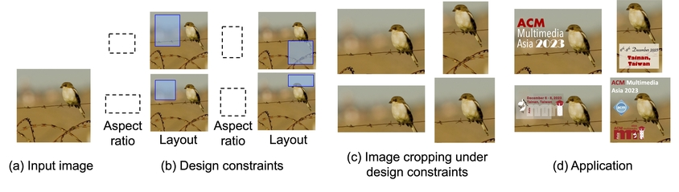

## Paper: Image Cropping under Design Constraints

Takumi Nishiyasu<sup>1</sup>, Wataru Shimoda<sup>2</sup>,  Yoichi Sato<sup>1</sup>  
<sup>1</sup>Tokyo University, <sup>2</sup> CyberAgent.Inc

Accepted to ACMMM Asia 2023.
[[Publication](https://arxiv.org/abs/2310.08892)]
[[Arxiv](https://arxiv.org/abs/2310.08892)]
[[project-page](https://cyberagentailab.github.io/image_cropping_under_design_constraints/)]




## Requirements
- Python3.9+

## Evaluation
This repository contains evaluation codes for ["Image Cropping under Design Constraints"](https://arxiv.org/abs/2310.08892).

- Evaluate the performance of the heatmap-based approach (iter_size = 100) by:

    ```bash
    python test.py --pred_file predictions.csv 
    ```


- predictions.csv is a file for evaluation. The structure of the file is as follows:
    - image file name, predicted bounding box [x1,y1,x2,y2], ground truth bounding box [x1,y1,x2,y2], layout bounding box [x1,y1,x2,y2]
    ```
    1011366896_Large.jpg,"[[0, 0, 768, 768]]","[[0.0, 0.0, 756.0, 768.0]]","[[0.0, 0.0, 512.0, 384.0]]"

    1011366896_Large.jpg,"[[0, 0, 1024, 757]]","[[105.0, 0.0, 1024.0, 690.0]]","[[512.0, 0.0, 1024.0, 384.0]]"

    ...

    IMG_6266.jpg,"[[0, 96, 941, 736]]","[[0.0, 77.0, 911.0, 697.0]]","[[0.0, 170.0, 128.0, 682.0]]"
    ```

## Evaluation data
- The extended evaluation dataset is [here](/data/FLMS_blank_aspect.json)
- The JSON file contains the design constraints for preparing the `ground truth bounding box` and `layout bounding box` with image information of [FLMS](#reference)


- The structure of FLMS_blank_aspect.json is as follows:
    ```
    {
        "1011366896_Large-0-1_0158730158730158.png": {
        "image_name": "1011366896_Large.jpg",
        "aspect_ratio": "1.0158730158730158",
        "blank_space_index": 0,
        "blank_space": [
            0,
            0,
            512,
            384
        ],
        "blank_aspect_bbox": [
            0,
            0,
            756,
            768
        ]
        },
        "1011366896_Large-1-0_750816104461371.png": {...},
        
        ...

        "IMG_6266-4-0_6805708013172338.png": {
        "image_name": "IMG_6266.jpg",
        "aspect_ratio": "0.6805708013172338",
        "blank_space_index": 4,
        "blank_space": [
            0,
            170,
            128,
            682
        ],
        "blank_aspect_bbox": [
            0,
            77,
            911,
            697
        ]
        }
    }

    ```
## Reference
```bibtex
@inproceedings{flmsfang2014automatic,
  title={Automatic Image Cropping Using Visual Composition, Boundary Simplicity and Content Preservation Models},
  author={Fang, Chen and Lin, Zhe and Mech, Radomir and Shen, Xiaohui},
  booktitle={Proc. ACM International Conference on Multimedia (ACMMM)},
  pages={1105--1108},
  year={2014},
}
```

## Citation
If you use this code or find our work is helpful, please consider citing our work:

```bibtex
@inproceedings{nishiyasu2023cropping,
  title={Image Cropping under Design Constraints},
  author={Takumi, Nishiyasu and Wataru, Shimoda and Yoichi, Sato},
  booktitle={Proc. ACM International Conference on Multimedia Asia (ACMMMAsia)},
  year={2023},
}
```

## Contact
This repository is maintained by Takumi Nishiyasu(nisiyasu[at]iis.u-tokyo.ac.jp).
